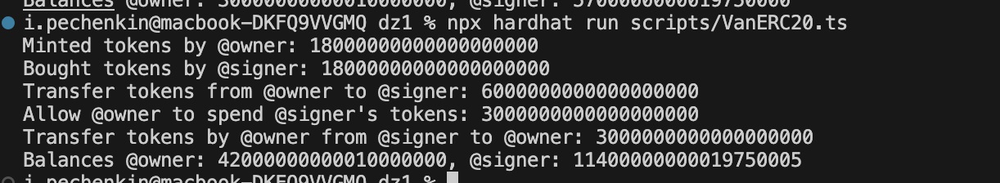
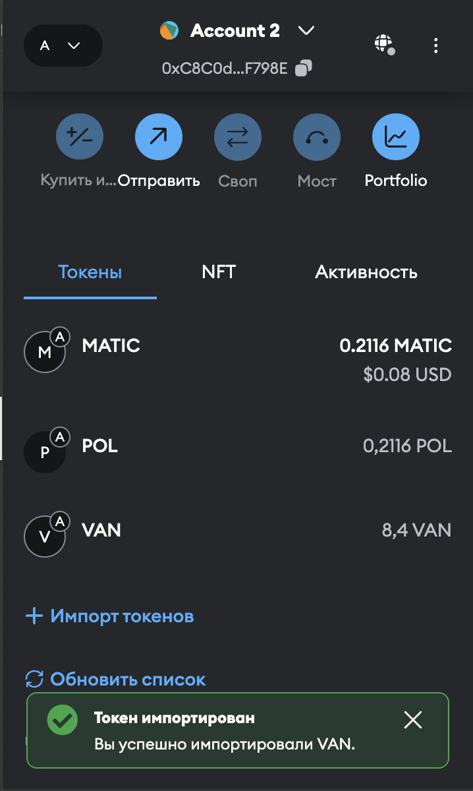
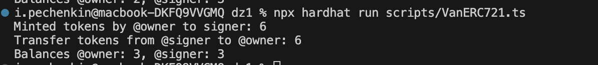
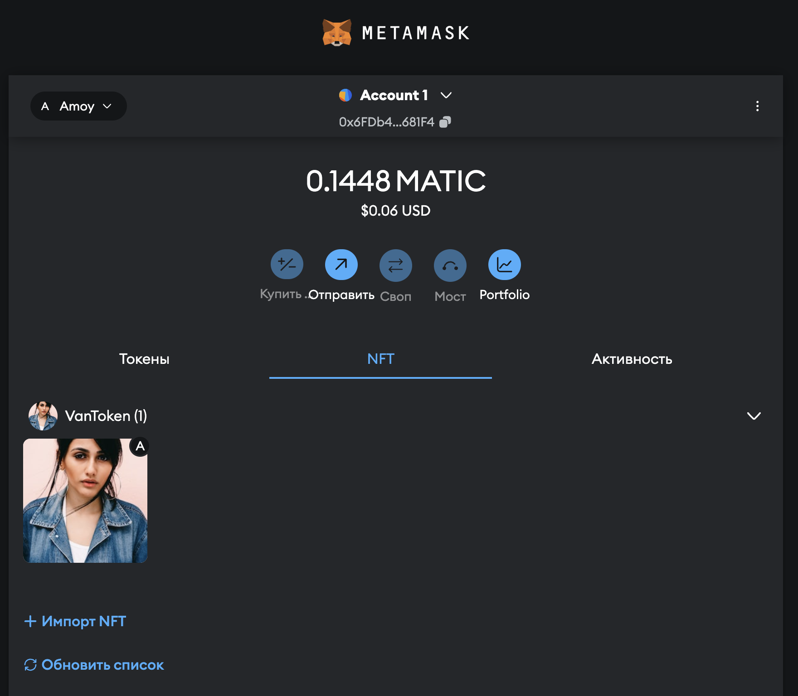
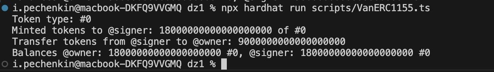
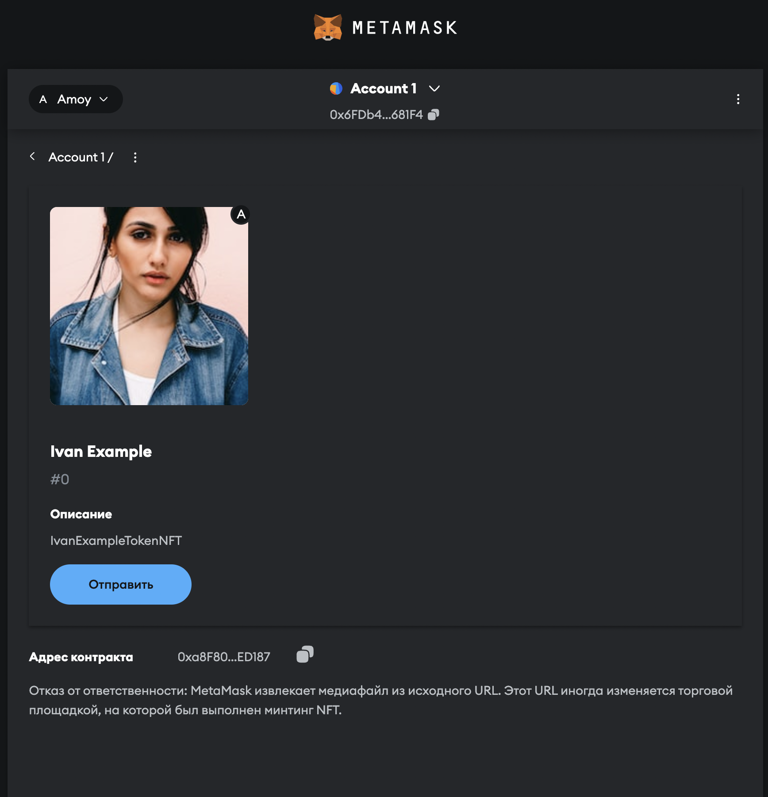

# ДЗ №1 по КПВ web3

## Ссылки на токены в обозревателе:

- ERC20 - VarERC20 - VAN - VanToken - https://amoy.polygonscan.com/address/0x18A719c48aE9cb41Db58a3Ac1B8b2a4ddAA23ad7#code
- ERC721 - VanERC721 - VAN - VanToken - https://amoy.polygonscan.com/address/0x3FB81908f5e110Fc4757d5c91F3F535fa166BF4a#code
- ERC1155 - VanERC1155 - VAN - https://amoy.polygonscan.com/address/0xa8F803E06948f6C8dDE9471bCE43D32da40ED187#code

## Ответы на вопросы:

1. Что такое функция approve и как она используется?

Функция approve используется, чтобы дать разрешение другому адресу управлять вашими токенами. Часто используется например на DEX - децентрализованных биржах, чтобы биржа могла автоматически перевести ваши токены покупателю.

2. В чем различие ERC721 и ERC1155?

ERC721 реализует NFT токены, тоесть невзаимозаменяемые токены. ERC1155 может использовать несколько типов токенов в одном СмК, каждый такой токен взаимозаменяем.

3. Что такое SBT токен?

Soul bound token - токен, который является полностью уникальным и привязывается к адресу. Не может быть передан или изменен.

4. Как можно сделать SBT токен?

Можно написать СмК. При вызове функции, например collect() проверять что у адреса еще нет токена и выпускать уникальный токен на этот адрес. В качестве базы можно использовать ERC721.

## Комментарии

Развернул метаданные на своем домене:

https://vanchenkin.ru/1.json

Запуск деплоя:
```
npx hardhat ignition deploy ./ignition/modules/VanERC20.ts --network polygon_amoy --verify
npx hardhat ignition deploy ./ignition/modules/VanERC721.ts --network polygon_amoy --verify
npx hardhat ignition deploy ./ignition/modules/VanERC1155.ts --network polygon_amoy --verify
```

Не смог ничего понять со storage контракта и слотами.

## Скриншоты

### ERC20

Запуск скрипта:


Отображение токенов в кошельке:


### ERC20

Запуск скрипта:


Отображение токенов в кошельке:


### ERC20

Запуск скрипта:


Отображение токенов в кошельке:

